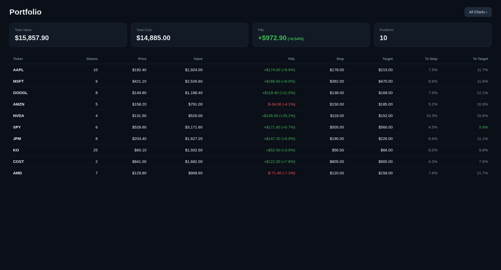
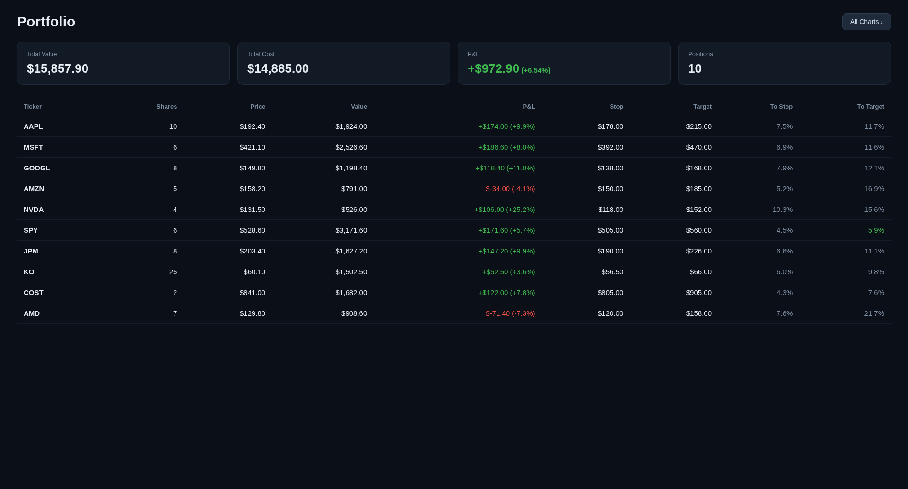
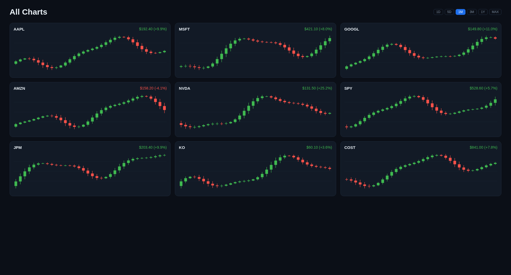
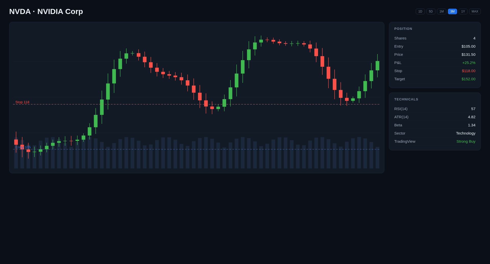
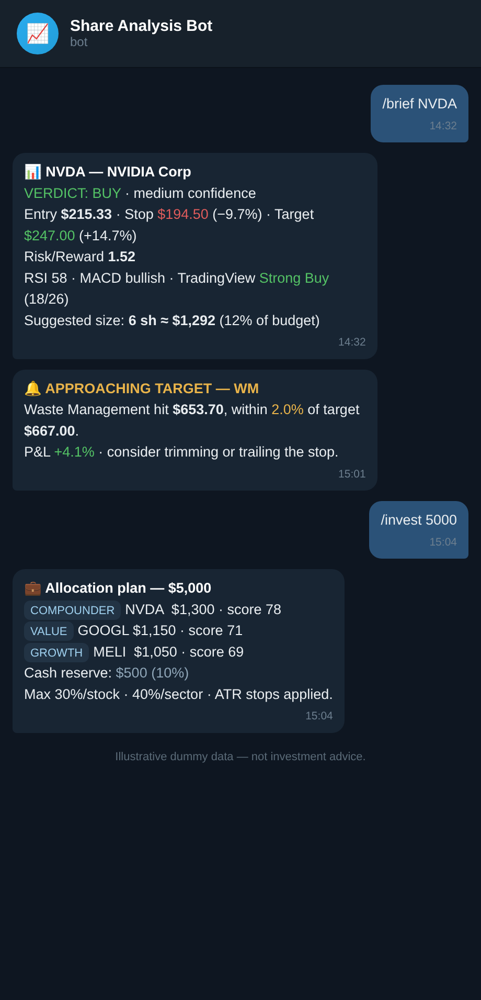

# Share Analysis Agent

An AI-powered investment analysis platform that transforms how individual investors process stock recommendations. It monitors Telegram channels for trading signals, enriches them with real-time market data, and delivers actionable analysis through multiple interfaces — all for a fraction of what traditional advisory services cost.

## Demo



_Auto-playing walkthrough — portfolio dashboard, all-charts overview, position detail, and the interactive Telegram bot. All data is illustrative._

## Screenshots

> Dummy data shown for illustration purposes.

### Dashboard


### All Charts


### Position Detail


### Telegram Bot


## The Problem

Individual investors with $10K-$15K portfolios face a structural disadvantage:

- **Information overload:** Dozens of Telegram/Discord channels push hundreds of stock recommendations daily. No human can evaluate them all in real time.
- **Missing context:** Channel recommendations rarely include current fundamentals, technicals, or position sizing for your specific budget.
- **Delayed action:** By the time you manually research a recommendation, the entry window has often closed.
- **No portfolio view:** Tracking positions across multiple sources with live P&L requires expensive tools or tedious spreadsheets.
- **No automated risk management:** Stop-loss and target levels require constant manual monitoring.
- **Advisory costs:** Professional advisory services charge $200-$500/month for what is increasingly automatable analysis.

## The Solution

This platform automates the entire recommendation-to-decision pipeline:

```
Channel recommendation arrives
        |
        v
   AI extracts ticker, entry, targets, stop loss (< 3 seconds)
        |
        v
   Live market data fetched (Yahoo Finance + TradingView)
        |
        v
   AI analyst evaluates: fundamentals, technicals, risk/reward,
   position sizing for YOUR budget ($10K-$15K)
        |
        v
   Alert delivered to your phone with full analysis
   (informational only — you decide whether to act)
```

**Total latency: 10-15 seconds** from channel post to actionable alert on your phone.

## Financial Impact

### Time savings
- **Manual research per recommendation:** 10-15 minutes (open charts, check fundamentals, calculate position size, assess risk)
- **Automated analysis:** 10-15 seconds
- **At 3-5 recommendations/day:** saves 30-75 minutes daily
- **Monthly value** (at ~20 trading days): **10-25 hours** of research you don't have to do manually

### Decision quality
- **Speed:** Alerts arrive within seconds of a channel post — you don't miss entry windows while manually researching
- **Consistency:** Every recommendation is assessed against a multi-factor scoring model (Fundamental Quality 40%, Valuation 25%, Technical Momentum 20%, Risk Deductions -15%) — no fatigue, no FOMO, no anchoring bias
- **Risk management:** Every alert includes ATR-based stop losses, volatility-adjusted position sizing, and risk/reward ratio calibrated to your budget
- **Automated monitoring:** Price monitor continuously checks stop/target levels and sends Telegram alerts when levels are hit or approached
- **Fundamental-first analysis:** FCF yield, ROE, operating margins, D/E, revenue/earnings growth evaluated before any technical signals. Quality compounders at premium valuations are treated as normal, not defects
- **Audit trail:** Every analysis is logged — you can review what worked, what didn't, and why

### Portfolio management
- **Real-time P&L:** Live portfolio tracking across all positions with automatic price updates
- **Stop/target monitoring:** Continuous price surveillance with Telegram alerts for stop hits, target reached, and approaching levels
- **YAML persistence:** Portfolio auto-saves to `data/portfolio.yaml` every 5 minutes, auto-loads on boot — survives restarts
- **Broker sync:** Parse Wio Invest PDF statements to sync real holdings
- **LLM reconciliation:** One API call recalculates all stop/target levels using the finance agent with live market data
- **TradingView-style charts:** React web UI with candlestick charts, volume bars, entry/stop/target price lines
- **Telegram chart images:** `/chart TICKER` sends server-rendered candlestick charts with portfolio overlays directly to your phone
- **Telemetry:** InfluxDB stores price snapshots every 5 minutes during market hours — 90-day retention for performance review
- **Multi-interface:** Manage your portfolio from Claude Code, Telegram, the React web UI, or curl — whatever's fastest in the moment

### Cost comparison

| Service | Monthly cost | What you get |
|---------|-------------|--------------|
| Motley Fool Stock Advisor | $199 | 2 picks/month, no real-time analysis |
| Seeking Alpha Premium | $239 | Articles, ratings — manual research still required |
| Bloomberg Terminal | $2,400 | Everything, but wildly overbuilt for a $15K portfolio |
| **This platform** | **~$3-9** (API costs) | Real-time channel monitoring, automated analysis, portfolio tracking, charts, price alerts, conversational AI |

The platform's running cost is primarily LLM API usage at roughly $0.01-0.03 per analysis. At 3-5 analyses/day over 20 trading days, that's $3-9/month. Provider-agnostic via LiteLLM — use any OpenAI-compatible API.

## Architecture

Five independent agents + a React frontend sharing a common data layer:

| Agent | Interface | Purpose |
|-------|-----------|---------|
| **Channel Monitor** | Background process | Watches Telegram channels, runs 3-stage analysis pipeline, sends alerts |
| **MCP Finance Server** | Claude Code | 9 tools for live quotes, technicals, analysis history, portfolio CRUD + levels |
| **Telegram Chat Bot** | Your Telegram bot | Interactive LLM-powered finance chat with commands, portfolio import, chart images |
| **Price Monitor** | Background process | Continuous stop/target surveillance, Telegram alerts, telemetry, YAML auto-save |
| **FastAPI Backend** | REST API (:8000) | Serves React frontend, portfolio CRUD, OHLC charts, LLM reconciliation |
| **LiteLLM Proxy** | Docker (:4000) | Provider-agnostic LLM gateway — swap backends without code changes |

```
Telegram Channels ──Telethon──> agents/channel_monitor.py ──> data/extracted.jsonl
                                       |
Claude Code ──MCP──> agents/mcp_server.py ──┐
                                             |──> core/database.py ──> data/portfolio.db
Telegram Bot ──Bot API──> agents/telegram_bot.py ──┘         |
                                                              |
agents/price_monitor.py ──polls prices──> alerts via Telegram  |
                           └──> core/timeseries.py ──> InfluxDB
                           └──> data/portfolio.yaml (auto-save)
                                                              |
React UI ──> api/ (FastAPI :8000) ──> core/ ──> portfolio.db + yfinance
                                        |
                              LiteLLM (:4000) ──> any LLM provider
```

## Quick Start

### Prerequisites
- Python 3.13+ with `uv`
- Node.js 18+ (for React frontend)
- Docker (for LiteLLM + InfluxDB)
- Telegram account + API credentials (free from my.telegram.org)
- Telegram bot token (free from @BotFather)
- Any OpenAI-compatible LLM API key

### Setup

```bash
# 1. Clone and configure
cd /path/to/duby
cp .env.example .env
# Edit .env with your credentials (LLM provider, Telegram, etc.)

# 2. Install dependencies
uv sync
cd frontend && npm install && cd ..

# 3. First run — authenticate Telegram (interactive, one-time)
uv run python -m agents.channel_monitor
# Enter your phone number and code when prompted

# 4. Start everything (Docker + all agents + API + frontend)
./deploy.sh start

# Stop / restart / check status
./deploy.sh stop
./deploy.sh restart
./deploy.sh status
```

### Portfolio Setup

```bash
# Edit my_portfolio.yaml with your positions (shares + unit_cost only)
vi my_portfolio.yaml

# Import — replaces all positions, auto-calculates stop/target from ATR
curl -X POST localhost:8000/api/portfolio/import \
  -H 'Content-Type: application/yaml' --data-binary @my_portfolio.yaml

# Run LLM reconciliation — refines stop/target using support/resistance analysis
curl -X POST localhost:8000/api/portfolio/reconcile
```

### Claude Code Integration

The MCP server auto-starts when you launch Claude Code in this directory. Try:

```
> What's the current price of AAPL?
> Show me technical analysis for NVDA
> Add 50 shares of MSFT at $450 to my portfolio
> Show my portfolio
```

### Telegram Bot

Message your bot (configured with `ALERT_BOT_TOKEN`):

```
/quote AAPL                      — Quick price check
/brief AAPL                      — Quick BUY/SCALE-IN/WAIT/AVOID verdict
/analyze NVDA                    — Full detailed analysis
/invest 10000 AAPL MSFT NVDA     — Multi-factor portfolio optimization
/chart NVDA 3mo                  — Candlestick chart image with price lines
/add TSLA 20 180.50              — Add to portfolio (auto-calculates stop)
/add TSLA 20 180.50 165 210      — Add with explicit stop/target
/setstop NVDA 175 240            — Set/update stop-loss and target
/levels                          — Show all stop/target distances
/sync                            — Upload Wio PDF to sync portfolio
/remove TSLA                     — Remove from portfolio
/portfolio                       — View P&L + stop/target info
/reset                           — Clear all positions
What do you think about MSFT?    — Concise BUY/SCALE-IN/WAIT/AVOID answer
```

### React Frontend

Open `http://localhost:5173`:
- **Dashboard** — Summary cards, positions table with value/P&L/stop/target, link to All Charts
- **All Charts** — Grid of candlestick charts for all positions with shared range selector
- **Position Detail** — Click any row: full candlestick chart with volume, entry/stop/target lines, range selector, position info, technicals

## Data Sources

| Source | Cost | Data | Rate limits |
|--------|------|------|-------------|
| Yahoo Finance (`yfinance`) | Free | Price, fundamentals, historical data, technicals | Generous for personal use |
| TradingView (`tradingview_ta`) | Free | Buy/sell/neutral signal counts, oscillator + MA consensus | No hard limits |
| LiteLLM + any LLM provider | Pay-per-use | LLM analysis (extraction + evaluation) | Depends on provider |
| InfluxDB 2.7 | Free (self-hosted) | Time-series telemetry (price + portfolio snapshots) | N/A |

No special accounts needed for market data. The LLM API is the only paid component. LiteLLM supports 100+ providers (OpenAI, Anthropic, Azure, AWS Bedrock, Google, Ollama, etc.) — configure once in `litellm/config.yaml`.

## Risk Disclaimer

This platform is an analysis tool, not financial advice. It automates research and provides data-driven evaluations, but:

- Past performance of any analysis model does not guarantee future results
- The LLM can misinterpret recommendations or produce incorrect analysis
- Market data has inherent delays (yfinance is not a real-time feed)
- Position sizing suggestions are mechanical calculations, not personalized advice
- Always verify critical trades independently before executing

**You are responsible for your own investment decisions.**

## License

Licensed under the **Apache License 2.0** — see [LICENSE](LICENSE). © 2026 Marlon Paz.
